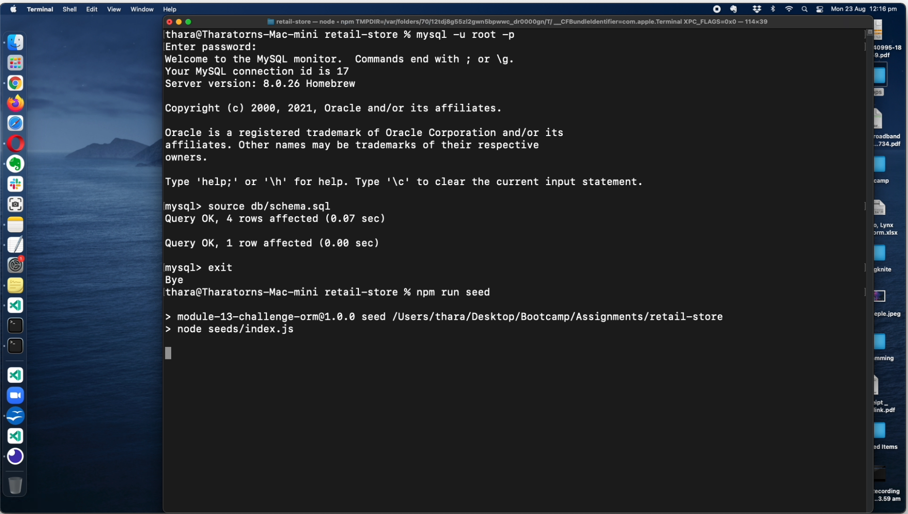

# retail-store

## <h2 id="description"> Description </h2>

A back end API for e-commerce application that allows user to CREATE, READ, UPDATE and DELETE products, categories and tags. It uses Express.js API in conjunction with Sequelize to interact with a MySQL database.

### <h3 id="preview"> Preview </h3>

The following videos show how the application responds to requests in Insomnia Core.

The following video show the application's GET / POST / PUT / DELETE routes to tags, tested in Insomnia Core:

The following video show the application's GET / POST / PUT / DELETE routes to categories, tested in Insomnia Core:

The following video show the application's GET / POST / PUT / DELETE routes to products, tested in Insomnia Core:

## <h2 id="table-of-contents"> Table of Contents </h2>

- [Description](#description)
- [Installation](#installation)
- [Usage](#usage)
- [Tests](#tests)
- [License](#license)

## <h2 id="installation"> Installation </h2>
[(Back to top)](#table-of-content)

### Step 1: Load and install all dependencies

To use this project, first clone the repo on your device using the commands below:

    git clone https://github.com/Supasiti/retail-store.git

Then install all the required libraries by running the follow command

    npm i 

### Step 2: Setting up MySQL

After installing all the dependencies, you would need to set up MySQL. An instruction on how to do this on your local computer can be found [here](https://www.mysql.com). After setting up MySQL, you would need to initialise the schema and populate with sample data. Go to the folder, and run MySQL:
  
    cd ~/pathto/retail-store
    retail-store> mysql -u root -p
    Enter password: 

Once in, you can run the following command:

    mysql> source db/schema.sql;

and then exit.

    mysql> exit

### Step 3: Connecting retail-store to MySQL 

On the root folder, create and open `.env` file:

    retail-store> touch .env
    retail-store> open .env

In the `.env` file, enter all the following details:

    DB_USER=root
    DB_NAME=ecommerce_db
    DB_PASSWORD=<YOUR-OWN-PASSWORD>

### Step 4: Seeding database

After initialising the database, you can seed the database by running the following command:

    retail-store> node run seed
  
See a walkthrough video below on how to set up the database:

> Note that the environment variable set up step is omitted in the video for privacy.

## <h2 id="usage"> Usage </h2>
[(Back to top)](#table-of-content)

The access point for the appliction is in the main folder. The application can be run by the following commands:

    cd ~/pathTo/retail-store
    npm start

See a walkthrough video below on how to start the server:

## <h2 id="tests"> Tests </h2>
[(Back to top)](#table-of-content)

This project uses [Jest](https://jestjs.io) testing framework. This can be set up by running the following command:

    npm i --save-dev

Once the framework is downloaded, To test, run

    npm run test

## <h2 id="license"> License </h2>
[(Back to top)](#table-of-content)

Licensed under the [MIT](https://opensource.org/licenses/MIT) license.